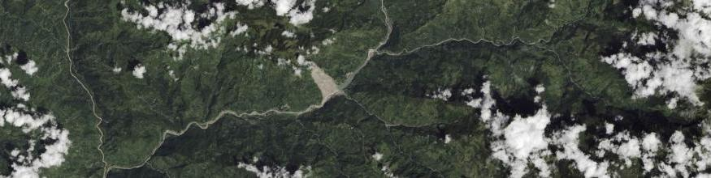
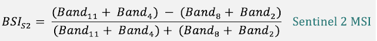
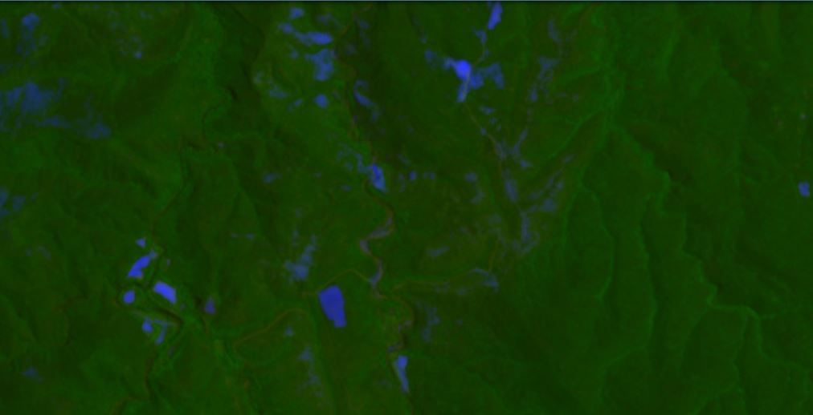
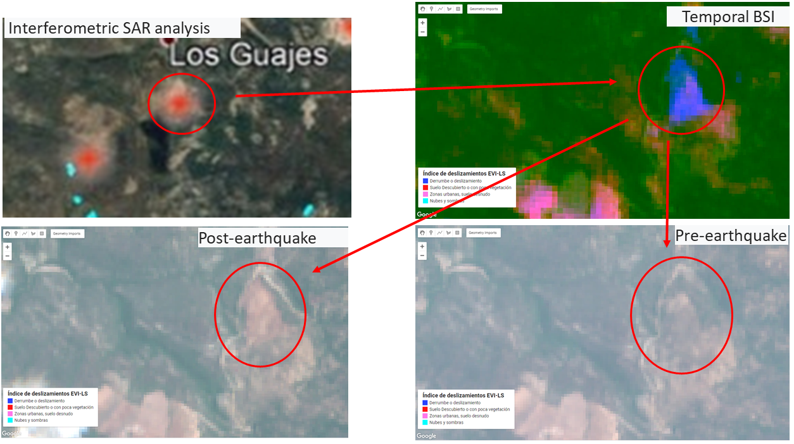
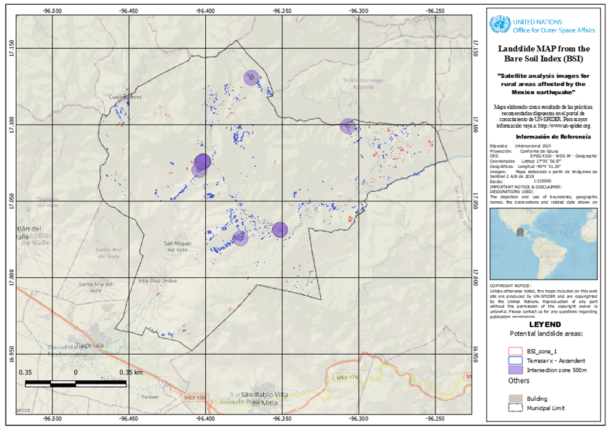

# LANDSLIDES 
</img>
 . 
</img>
 

# Descripción
The following is a collection of basic scripts, explained in **English and Spanish** for digital image processing in [**Google Earth Engine (GGE)**](https://earthengine.google.com/), [**Sentinel Playground**](https://www.sentinel-hub.com/explore/sentinelplayground/) or [**EO Browser**](https://www.sentinel-hub.com/explore/eobrowser/) in order to be able to work with data massively in the cloud using open source software, as an alternative to proprietary desktop software.
# 1. Definition
The term “landslide” refers to a variety of processes that result in the downward and outward movement of slope-forming materials, including rock, soil, artificial fill, or a combination of these. The materials may move by falling, toppling, sliding, spreading, or flowing [UNDRR](https://www.unisdr.org/files/52828_03landslidehazardandriskassessment.pdf#page=2). 
# 2. General description of the script
The landslide and mass removal processes that occurred in the southern area of `Oxaca in Mexico - 2020`, were studied in the region of La Soledad, using **Sentinel 2** images, Radar Image Analysis and Digital Terrain Models (DTM). A specific algorithm was developed to establish a model for automatic extraction of the traces of the ground movements. By using the Bare Soil Index (BSI) at two different times. This was reduced to a temporal composition **(SBI1, NIR, SBI2)**. The results allow to extract the shapes of the landslides in the terrain, and allow to calculate their direction of movement. It was observed that there is a close relationship between most of the landslide processes on slopes in front of the areas detected by radar. The methodology proposed is a useful tool for extracting and characterizing mass clearance processes from Sentinel 2 high-resolution satellite images.
# 3. Barren Soil Script
Bare Soil Index (BSI) is a numerical indicator that combines blue, red, near infrared and short wave infrared spectral bands to capture soil variations. These spectral bands are used in a normalized manner. The short wave infrared and the red spectral bands are used to quantify the soil mineral composition, while the blue and the near infrared spectral bands are used to enhance the presence of vegetation. BSI can be used in numerous remote sensing applications, like soil mapping, crop identification (in combination with NDVI) etc. To calculate the BSI with the following formulas (one for each satellite):
</img>
 

# 3. Interpretación and description of images

</img>
 

The naked index is applied to the blue and red channels. It shows all vegetation in green and the potential slippery ground in blue. It can be useful for soil mapping as it informs the user where to do remote sensing analysis on the bare soil, where crops have been harvested or where they are not growing, the location of landslides or the extent of erosion in non-vegetated areas. Unfortunately, it also highlights certain buildings, making areas of bare soil difficult to separate from houses. It should be noted that the result depends on the vegetation and agriculture of the season.
</img>
 
The different tests carried out showed that the SBI temporal and the B3 band reflectance are sufficient to identify the traces of the mass removal processes. In the case of the index, the BSI alone does not make it possible to characterize the features investigated that do not correspond solely to an absence of active vegetation, especially since the Sentinel 2 image has cloud cover and a reactivation of the vegetation was observed locally. Therefore, the temporal values of the SBI need to be taken into account.
</img>
 

# Evaluate and visualize
<a href="#" id='togglescript'>Show</a> script or [download](script_TBSI.js){:target="_blank"} it.


      


* [Google Earth Engine](https://code.earthengine.google.com/839e29e8409b509c703ff2718818979b)
* [Sentinel Playground](https://apps.sentinel-hub.com/sentinel-playground/?source=S2&lat=16.444296750697553&lng=-96.42880439758301&zoom=15&preset=CUSTOM&layers=B01,B02,B03&maxcc=39&gain=1.0&gamma=1.0&time=2019-12-01%7C2020-06-27&atmFilter=&showDates=false&evalscript=Ly9JbmRpY2UgdGVtcG9yYWwgZGUgc3VlbG8gZGVzbnVkbywgVmVyLiAxLjAKLy90ZW1wb3JhbCBCYXJyZW4gU29pbCBTY3JpcHQKCmxldCBCU0kgPSAoKEIxMSArIEIwNCktKEIwOCArIEIwMikpLygoQjExICsgQjA0KSsoQjA4ICsgQjAyKSkKIApyZXR1cm4gWyBCMDQsIEIwOCwgQlNJICogNi4yNV07Cg%3D%3D){:target="_blank"}
* [EO Browser](https://apps.sentinel-hub.com/eo-browser/?zoom=15&lat=16.05614&lng=-96.26152&themeId=DEFAULT-THEME&datasetId=S2L2A&fromTime=2020-04-28T00%3A00%3A00.000Z&toTime=2020-04-28T23%3A59%3A59.999Z&visualizationUrl=https%3A%2F%2Fservices.sentinel-hub.com%2Fogc%2Fwms%2Fbd86bcc0-f318-402b-a145-015f85b9427e&evalscript=Ly9WRVJTSU9OPTEKLy9JbmRpY2UgdGVtcG9yYWwgZGUgc3VlbG8gZGVzbnVkbywgVmVyLiAxLjAKLy90ZW1wb3JhbCBCYXJyZW4gU29pbCBTY3JpcHQKCmxldCBCU0kgPSAyLjUgKiAoKEIxMSArIEIwNCktKEIwOCArIEIwMikpLygoQjExICsgQjA0KSsoQjA4ICsgQjAyKSkKIApyZXR1cm4gWyBCMDQsIEIwOCwgQlNJICogNi4yNV07Cg%3D%3D){:target="_blank"} 

# References
OCHOA-TEJEDA, Verónica  y  PARROT, Jean-François.Extracción automática de trazas de deslizamientos utilizando un modelo digital de terreno e imágenes de satélite de alta resolución IKONOS: Ejemplo en la Sierra Norte de Puebla, México. Rev. mex. cienc. geol [online]. 2007, vol.24, n.3, pp.354-367. ISSN 2007-2902.
# Author of the script
- Norma Davila
- Alexander Ariza

 </img>
<i>
The previous compilation is organized to support the knowledge portal of the office of [**UNSPIDER**](https://www.un-spider.org), (2020). 
